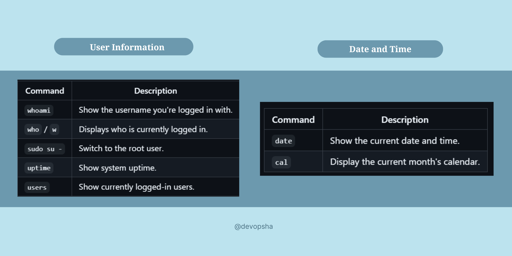

<p align="center">
  
</p>

---
 
<details>
  <summary><strong>📖 Table of Contents</strong></summary>
  <br>
  <table border="1" cellspacing="0" cellpadding="5">
    <tr>
      <td><a href="#-basic-features-of-linux">🔥 Basic Features of Linux</a></td>
    </tr>
    <tr>
      <td><a href="#-unix-vs-linux-comparison">⚖️ Unix vs Linux Comparison</a></td>
    </tr>
    <tr>
      <td><a href="#-popular-linux-distributions">🏆 Popular Linux Distributions</a></td>
    </tr>
    <tr>
      <td><a href="#-layered-architecture-of-linux">🏗️ Layered Architecture of Linux</a></td>
    </tr>
    <tr>
      <td><a href="#-how-to-get-a-linux-system">🔧 How to Get a Linux System</a></td>
    </tr>
  </table>
</details>


<table>
  <tr>
    <td width="50%" valign="top">

### 📜 Early Roots (1960s–1980s)
- **Unix (1969–1970s):** Developed at AT&T Bell Labs, Unix became a multi-user, multitasking OS.
- **Why Linux?** Unix was not free, leading to the need for an open-source alternative.

</td>
    <td width="50%" valign="top">

### 🚀 Growth & Open Source (1990s)
- **GNU Project:** Richard Stallman’s FSF initiated GNU to replace proprietary Unix.
- **Linux + GNU:** The Linux kernel combined with GNU tools created a complete OS.

</td>
  </tr>
  <tr>
    <td colspan="2" align="center">

### 🐧 The Birth of Linux (1991)
 **Created by:** Linus Torvalds as a hobby project.
 **First Release:** August 25, 1991.

</td>
  </tr>
</table>


## 🚀 Growth & Open Source (1990s)
- **GNU Project:** Richard Stallman’s FSF initiated GNU to replace proprietary Unix.
- **Linux + GNU:** The Linux kernel combined with GNU tools created a complete OS.

## 🌍 Widespread Adoption (2000s–Present)
- **Linux Distros:** Red Hat, Debian, and Ubuntu made Linux widely accessible.
- **Servers & Data Centers:** Linux dominates due to reliability, performance & cost-efficiency.
- **Android:** Based on the Linux kernel, it became the world’s leading mobile OS.
- **Git:** Created by Linus Torvalds, revolutionizing version control.
- **Cloud & IoT:** Powers cloud computing, containerization (Docker, Kubernetes), and embedded systems.
---

## 🔥 Basic Features of Linux

- **🖥️ Portable:** Runs on different hardware platforms.
- **🔓 Open Source:** Freely available source code.
- **👥 Multi-User:** Supports multiple users simultaneously.
- **🛠️ Shell:** Command-line interface to interact with the system.
- **🔐 Security:** Highly secure and stable.

---

## ⚖️ Unix vs. Linux Comparison

| Feature        | Unix      | Linux  |
|---------------|-------|--------|
| **Cost**      | Proprietary (Paid)     | Free & Open Source |
| **Source Code** | Closed     | Open Source |
| **Users** | Mainly Enterprises     | Individuals & Enterprises |
| **Security** | Secure     | Highly Secure |
| **Customizability** | Limited     | Highly Customizable |
| **Distributions** | Single (varies by vendor)     | Ubuntu, Fedora, Debian, etc. |

---

## 🏆 Popular Linux Distributions

1. Red Hat Enterprise Linux (RHEL)
2. Fedora Linux
3. Debian Linux
4. SUSE Enterprise Linux
5. Ubuntu Linux

---

## 🏗️ Layered Architecture of Linux

- **Hardware Layer:** Physical devices like CPU, RAM, HDD.
- **Kernel Layer:** Core component managing hardware resources.
- **Shell Layer:** Command-line interface between users and the kernel.
- **User Layer:** Applications and utilities that interact with the shell.

---

## 🔧 How to Get a Linux System

1. **Install directly on a Laptop or Desktop.**
2. **Use a Virtual Machine** (VMWare/VirtualBox).
3. **Provision a Linux VM** on cloud platforms (AWS, Azure, GCP).
4. **Use a Docker Image** for lightweight experimentation.
5. **Try an Online Linux Terminal** for practice.

---


---

<p align="center">🚀 <strong>Linux is Everywhere! Embrace Open Source!</strong> 🐧</p>


# 📚 **Linux Commands Cheat Sheet** 🐧

## 📑 **Table of Contents**

1. [Basic Linux Commands](#basic-linux-commands)
2. [File and Directory Operations](#file-and-directory-operations)
3. [View Files (Open/Read)](#view-files-openread)
4. [File and Directory Management](#file-and-directory-management)
5. [Advanced Usage](#advanced-usage)
6. [Visuals & Examples](#visuals-examples)
7. [Usage Tips](#usage-tips)
8. [Resources](#resources)
9. [Contributing](#contributing)

A comprehensive cheat sheet of essential Linux commands to help you navigate, manage files, and perform administrative tasks easily!

---

## 🔑 **Basic Linux Commands**:

<p align="center">
  
</p>


### 📖 Manual Pages:
- **`man <command>`**: Show the manual of a specific command. (`man cal`)

---

## 💻 **File and Directory Operations**:

### 📂 Directory Navigation:
- **`pwd`**: Print the current working directory.
- **`cd <directoryname>`**: Change directory.

### 🧹 Clear Screen:
- **`clear`**: Clear the terminal screen.

---

## 🗂 **View Files (Open/Read)**:

### 📜 Display File Contents:
- **`ls`**: List files in the current directory.
- **`cat <filename>`**: Display file content.
- **`less <filename>`**: View file content page by page. (Use `space` to scroll, `q` to quit)
- **`more <filename>`**: Similar to `less` but displays content in percentage. (Use `space` to scroll, `q` to quit)

### 🔝 Top/Last Lines:
- **`head -<num_of_lines> <filename>`**: Show the first n lines of a file.
- **`tail -<num_of_lines> <filename>`**: Show the last n lines of a file.

---

## 🛠 **File and Directory Management**:

### 📝 Create/Edit Files:
- **`touch <filename>`**: Create a new empty file.
- **`cat > <filename>`**: Create a file and start writing content.
- **`nano <filename>`**: Create/edit a file with the nano editor.
- **`vi <filename>`**: Create/edit a file with the vi editor.

### ❌ Remove Files:
- **`rm <filename>`**: Remove a file.
- **`rm -rf <directoryname>`**: Remove a directory and its contents.

### 🏗 Create and Remove Directories:
- **`mkdir <directoryname>`**: Create a new directory.
- **`rmdir <directoryname>`**: Remove an empty directory.

---

## ⚙️ **Advanced Usage**:
- **`sudo`**: Execute a command as another user (commonly root).
- **`chmod`**: Change the permissions of files or directories.
- **`chown`**: Change file owner and group.

---

## 🎨 **Visuals & Examples**:

> 💡 _Here's an example of using the `ls` command to list files in a directory:_

```bash
$ ls
file1.txt  file2.txt  my_directory/

$ cat file1.txt
This is the content of file1.


